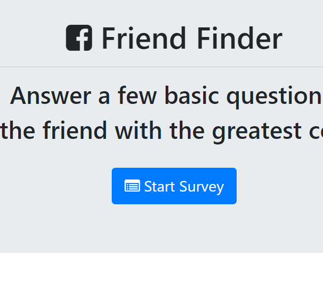

# friend-finder
This is a NODE app that uses the express package to help friends with similar personalities match with each other.

## Overview of the organization of the app and how to use it
* the app presents the user with a 10 question survery that stores personality preferences which are compared to personality preferences with other "friends" in the app friends database.
* the user types their name, includes a photo link and provides answers to personality questions and this information data is stored as an object.  
* the personality questions "scores" are then compared to the scores of other "friends" and the "friend" with the closest scores is listed as the user's match. 
* the app then displays the name and photo of their matched friend. 
* note that the user's inputted data is also added to the database of friends so that they are included in future searches with a new user. 

## link to the Github repository - this app is a nodeJS app which can be run on a command line interface like Gitbash
* https://github.com/sahasra101/friend-finder

## link to the deployed site on Heroku 
* https://afternoon-ocean-50601.herokuapp.com/

## screenshot of the app functioning

Home page displayed:

## Technologies used in this app:
* HTML
* CSS using Bootstrap with Modals
* javascript
* AJAX and APIs
* nodeJS
* npm packages: express

## HTML, CSS, Javascript and nodeJS coding by Ajay Kiri with minor assistance from software teaching activities from the UPenn/Trilogy NodeJS Bootcamp lessons and various google searches. 